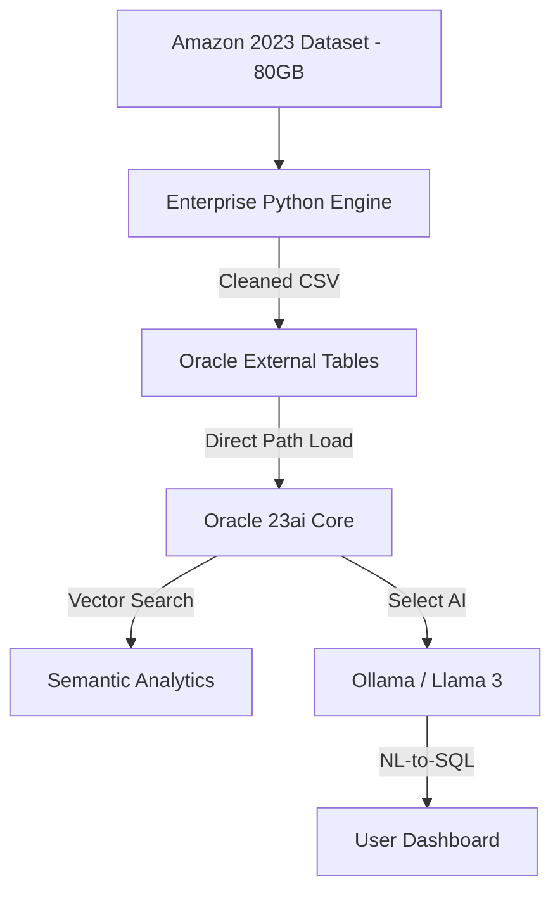

# 🤖 Local Enterprise AI: 83GB Amazon Reviews Analysis
[](#)
[](#)
[](#)

A high-performance, private AI system built on **Oracle Database 23ai** and **Ollama**, designed to perform semantic analysis and natural language querying over a massive **83.6GB Amazon Reviews 2023** dataset.


## 🚀 Key Features
- **Direct Path Data Engineering**: Automated Python streaming pipeline for ingesting 80GB+ JSONL/Parquet data without memory overflow (Low-RAM mode).
- **Relational-Vector Hybrid**: Storing high-velocity sales data (Relational), product specifications (JSON), and customer sentiment (Vector) in a single unified engine.
- **Thinking Database (Select AI)**: Natural Language to SQL bridge using **Llama 3** (local). Ask questions in Vietnamese or English and get SQL results instantly.
- **Enterprise Security**: 100% Local execution on private hardware (Ryzen 9 / RTX 4060 Ti). No third-party API dependencies.

## 🏗️ One-Command Deployment (New Machine)
To setup the entire 83GB system on a new machine:
1. **Prepare Environment**: Ensure Docker and Python 3 are installed.
2. **Setup Script**:
   ```bash
   chmod +x setup_enterprise_ai.sh
   ./setup_enterprise_ai.sh
   ```
   *The script will automatically create a venv, download the 80GB dataset, organize folders, and start Docker.*

## 🏢 Architecture


## 🛠️ Stack
- **Database**: Oracle Database 23ai (Supports native VECTOR data type).
- **Orchestration**: Docker & Docker-Compose.
- **AI Backend**: Ollama serving Llama 3 (8B) for embeddings and translation.
- **Front-end**: Oracle APEX for real-time visualization.

## 📍 Getting Started
### 1. Repository Setup
```bash
git clone https://github.com/congkx123789/He_quan_tri.git
cd He_quan_tri
```

### 2. Infrastructure
```bash
docker-compose up -d
```

### 3. Data Acquisition
Run the enterprise downloader to pull the 83.6GB target dataset:
```bash
python3 python/enterprise_download_80gb.py
```

### 4. Oracle Ingestion
Execute the SQL loading scripts in order:
- `sql/01_schema.sql` (Tables)
- `sql/04_external_tables.sql` (External Linking)
- `sql/06_ingestion_direct_load.sql` (Primary Load)

## 📎 License
Privately developed for Enterprise AI Demonstration.
