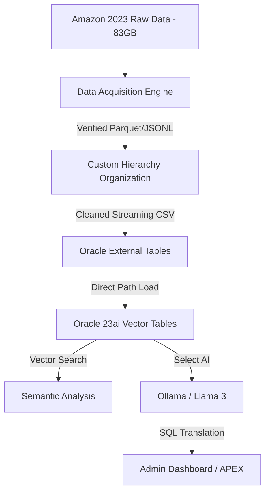

# 🤖 Local Enterprise AI: 83GB Amazon Reviews Analysis
[](#)
[](#)
[](#)
[](#)

A high-performance, private AI system built on **Oracle Database 23ai Free Edition** and **Ollama**, designed to perform high-velocity data engineering, semantic vector analysis, and natural language querying over a massive **83.6GB Amazon Reviews 2023** dataset.


## 🌟 Executive Summary
This project demonstrates a production-grade **Local Enterprise AI** architecture. It bridges the gap between massive, unstructured data (80GB+ JSONL/Parquet) and actionable business intelligence using a "Thinking" Vector Database. The entire stack runs locally on a personal machine, ensuring 100% data privacy and zero API costs.

---

## 🚀 Key Technological Pillars

### 1. High-Velocity Data Engineering (The "Enterprise Engine")
- **Scale**: Successfully processed over **67,000,000 customer reviews** and millions of product specs.
- **Safe-Mode Architecture**: Optimized for high-volume environments using a **Streaming Processor** that maintains a memory footprint of **< 1GB** even when handling 30GB+ individual files.
- **In-Stream Cleaning**: Automatic price normalization, high-performance deduplication (via hashing), and HTML scrubbing during the ingestion path.

### 2. The Hybrid Thinking Database (Oracle 23ai)
- **Multi-Model Native Support**: Managing Relational (Sales), Document (JSON Specs), and Unstructured (Vector Reviews) data in one ACID-compliant engine.
- **Direct Path Loading**: Leverages Oracle's `/*+ APPEND */` logic and External Tables to achieve "bare-metal" throughput during ingestion from CSV to Vector tables.
- **Semantic Vector Search**: Native HNSW indexing for instant sentiment and topic discovery across millions of records.

### 3. Generative AI Orientation (Select AI)
- **Select AI Integration**: Bridges Oracle's internal query engine to a local **Ollama** instance serving **Llama 3 (8B)**.
- **Natural Language Analytics**: Allows non-technical users to query the database using standard language:
  - *VN*: "Tìm cho tôi các sản phẩm điện tử dưới 200$ được đánh giá cao nhất."
  - *EN*: "Find Top-3 electronics under $200 with high durability ratings."

---

## 🏗️ Architecture & Data Flow


---

## 📂 Project Organization
- `/python`: The Engineering Core (Downloader, Organizer, Safe-Mode Processor).
- `/sql`: The AI/DB Core (Schema, Vector Setup, Select AI Configuration, Ingestion).
- `/data`: Organized dataset hierarchy (Excluded from Git, documented via `data/README.md`).
- `/scripts`: Container orchestration and entrypoints.

---

## 📍 Multi-Mode Deployment (Portability)

### Mode A: Python Virtual Environment (Lightweight)
Perfect for local development. Handles data acquisition and organization via a local venv.
```bash
make setup-venv
```

### Mode B: Total Isolation (Docker Mode)
The entire "Enterprise Engine" is containerized. Requires only Docker to be installed on the host.
```bash
make setup-docker
```

---

## ⚙️ Hardware Specifications (Reference)
This system is optimized for high-end local workstations:
- **Processor**: High-performance Multicore CPU.
- **GPU**: NVIDIA GPU with 8GB+ VRAM (Recommended for LLM acceleration).
- **Memory**: 32GB+ RAM (Supported via Safe-Mode Streaming).
- **Storage**: ~250GB Free SSD space target.

---

## 📎 License & Security
- **Security**: All API Keys/Tokens are managed via `.env` (excluded from Git).
- **Privacy**: No data leaves the local network. All LLM processing is handled by Ollama.

*Crafted with 🤖 for Enterprise-grade AI Demonstrations.*
